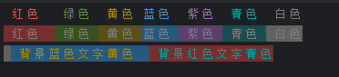

# 通过 Ftp 部署前端项目

在进行前端项目部署时，通常是自己打包，然后将打包好的文件发送给后端的同事，然后由后端将文件部署到服务器上。
但是这样部署的方式感觉比较麻烦，所以就想尝试通过 ftp 部署前端项目。

## 前提条件

服务器开启了 ftp 服务，且具有操作文件的权限。
这里使用的是 window server 操作系统，可以通过 IIS 来开启 ftp 服务
具体操着步骤可以参考 [Windows Server 2019 搭建FTP站点](https://www.cnblogs.com/wencg/p/13450938.html)

::: danger 注意
为了安全起见，设置好Ftp 服务器的密码
:::

## 思路

先梳理一下我们部署的操作步骤：

1. 对服务器上当前的包进行备份
2. 将本地打包好的文件上传到服务器上

使用 `basic-ftp` 来实现对服务器包的备份与新包的上传。

## 具体实现

### 1、安装 `basic-ftp`

`basic-ftp` 是一个 Node.js 的 ftp 客户端库，它提供了一种简单的方式来与 ftp 服务器进行交互。

::: code-group

```shell [npm]
npm install basic-ftp --save -D
```

```shell [yarn]
yarn add basic-ftp --save -D
```

```shell [pnpm]
pnpm install basic-ftp --save -D
```

:::

### 2、测试 ftp 连接

直接打开window 资源管理器，直接输入 `ftp://ip:端口号`，查看是否可以正常连接，若可以正常连接会看到 服务器对应目录下的文件

使用 `basic-ftp` 来连接 `ftp` 服务器,具体代码如下

```js
import {Client} from 'basic-ftp'
// 测试 连接
const test = async () => {
	const client = new Client()
	client.ftp.verbose = true  //所有套接字通信的调试级日志记录
	try {
		await client.access({
			host: "******",
			user: "******",
			password: "******",
			secure: true
		})
		const result = await client.list()
		console.log(result)
	} catch (err) {
		console.log(err)
	}
	client.close()
}

test()
```

运行成功后会输出 ftp 服务器上的文件列表，如下所示

```
 [ FileInfo {
    name: '.pnpm-store',
    type: 2,
    size: 0,
    rawModifiedAt: '07-23-24 04:38PM',
    modifiedAt: undefined,
    permissions: undefined,
    hardLinkCount: undefined,
    link: undefined,
    group: undefined,
    user: undefined,
    uniqueID: undefined
  }]
```

若未能成功运行，先排查账号密码是否正确，是否开启 ftp 服务，若这些内容没有问题，更具报错结果进一步排查。

### 3、备份与上传文件

**包备份**即将当前服务器上的包进行重命名,可以调用 `rename` 方法来完成文件夹重命名

`Client. rename(srcPath: string, destPath: string): Promise<FTPResponse>`

- srcPath: string - 要重命名的文件路径
- destPath: string - 重命名的目标文件路径

**上传包** 即将本地的文件夹上传到服务器，可调用 `uploadFromDir` 方法完成文件夹上传

`Client. uploadFromDir(localDirPath: string, remoteDirPath?: string): Promise<void>`

- localDirPath: string - 本地文件夹路径
- remoteDirPath?: string - 远程文件夹路径

参考代码如下：运行后，会看到服务器上 dist 文件夹被重命名为 dist_backup，并且 dist 文件夹中的文件被上传到服务器上

```js
import {Client} from 'basic-ftp'
// 文件备份与上传
const test = async () => {
	const client = new Client()
	client.ftp.verbose = true  //所有套接字通信的调试级日志记录
	try {
		await client.access({
			host: "******",
			user: "******",
			password: "******",
			secure: true
		})
		await client.rename('dist', 'dist_baackup')  // 文件重命名
		await client.uploadFromDir('../dist', 'dist') // 文件夹上传
	} catch (err) {
		console.log(err)
	}
	client.close()
}

test()

```

### 4、添加打印信息与进度显示

期望要输出的日志形式，如下所示：

- 开始部署
- 连接 `ftp` 服务器 结果
- 数据备份结果
- 开始上传数据
- 上传进度 loading 百分比 已上传的大小/总文件大小 正在上传的文件名
- 结果

```
 Start deploying...
 √  Successful connection to ftp server
 √  Data Backup Successful
 Start uploading data
⠋  8.21 %    597.01 Kb/7.10 Mb Uploading... front_element-plus-question.md.BMIisrhK.lean.js

```

要完成了这种形式的打印需要解决以下问题：
- 获取本地目录里边所有文件大小
- 进度相关日志打印在同一行 
- loading 动画
- 给打印的结果使用颜色区分

### 4.1 获取当前目录里边所有文件大小

```ts
/**
 * 递归计算目录的总大小
 * @param dirPath 目录路径 - 指定要计算大小的目录
 * @returns {number} 返回目录的总大小（以字节为单位）
 */
const getDirSize = (dirPath: string) => {
		// 读取目录中的所有文件和子目录
		const files = fs.readdirSync(dirPath)
		let size = 0
		files.forEach(file => {
			const filePath = path.join(dirPath, file)
			// 获取文件或子目录的元数据
			const stat = fs.statSync(filePath)
			if(stat.isFile()) {
				size += stat.size
			} else if(stat.isDirectory()) {
				size += getDirSize(filePath)
			}
		})
		return size
	}

```

### 4.2 追踪上传进度

`basic-ftp` 提供了 `trackProgress` 方法，该方法接受一个回调函数，该回调函数会在每次上传或下载时调用，并传入一个对象，该对象包含当前文件上传或下载的字节数、总字节数等信息。

在开始上传文件之前，设置好回调来输出上传进度

```js
const size = getDirSize('../../dist')
client.trackProgress(info => {
	const progress = `${(100 * (info.bytesOverall / size)).toFixed(2)}`
	console.log(`${progress} %    ${bytesToSize(info.bytesOverall)}/${sizeFormat} Uploading... ${info.name} `)
})
```
### 4.3 将进度最终输出在同一行
当文件较多时，关于进度输出的日志会比较多，不太美观，可以使用 `progress.stdout` 来因把进度信息放在在同一行输出
为了便于使用，这里写了一个 简答的`log` 函数

```ts
const log = (content: string) => {
	process.stdout.clearLine(0);  // 清除当前行
	process.stdout.cursorTo(0);   // 将光标移回到行首
	process.stdout.write(content);  // 每次从最右侧输出
}
```


### 4.4 对打印结果进行美化

- 上传添加 loading 动画	

参考网上的一些资料，如`cli-spinners`，可以循环打印一些字符，来实一个简单的 loading 效果
```ts
const frames = ['⠋', '⠙', '⠹', '⠸', '⠼', '⠴', '⠦', '⠧', '⠇', '⠏']
```

- 给打印结果添加颜色

需要对打印的结果添加颜色，如成功的相关内容打印绿色，失败的打印红色
要使 打印的结果颜色不同，可以使用 ANSI 转义码来设置控制台输出的文字颜色，详细内容可以参考
> [使用 ANSI 转义码随心所欲地操纵你的终端(改变输出文字颜色、彩虹渐变色、高亮、加粗、移动光标、隐藏光标等)](https://blog.csdn.net/Blaze_dL/article/details/142767515)

以下是一些常见的颜色代码:

| 背景色 | 前景色 |        代码         |
|:---:|:---:|:-----------------:|
| 黑色  | 黑色  | \x1B[30m \x1B[40m |
| 红色  | 红色  | \x1B[31m \x1B[41m |
| 绿色  | 绿色  | \x1B[32m \x1B[42m |
| 黄色  | 黄色  | \x1B[33m \x1B[43m |
| 蓝色  | 蓝色  | \x1B[34m \x1B[44m |
| 紫色  | 紫色  | \x1B[35m \x1B[45m |
| 青色  | 青色  | \x1B[36m \x1B[46m |
| 白色  | 白色  | \x1B[37m \x1B[47m |
| 重置  | 重置  |      \x1B[0m      |

具体使用方法 在要打印的文本前面加上对应的颜色代码，例如：
**输入:**
```js
console.log('\x1B[31m 红色  \x1B[32m 绿色 \x1B[33m 黄色 \x1B[34m蓝色 \x1B[35m 紫色 \x1B[36m 青色 \x1B[37m 白色')
console.log('\x1B[41m 红色  \x1B[42m 绿色 \x1B[43m 黄色 \x1B[44m蓝色 \x1B[45m 紫色 \x1B[46m 青色 \x1B[47m 白色')
console.log('\x1B[33m \x1B[44m 背景蓝色文字黄色 \x1B[36m \x1B[41m 背景红色文字青色')
```

**输出:**



## 接下来

- 制作成 vite 插件 发布在 npm
- 打包，直接执行 js 文件

编写 `vite` 的插件，通过 `vite` 的钩子，在打包完成后，执行上述的步骤。(不建议) 有时打包不需要上传
建议配置一个单独的启动脚本，来完成打包并部署

## 完整代码

<<< ../.vitepress/utils/FtpDeploy.ts