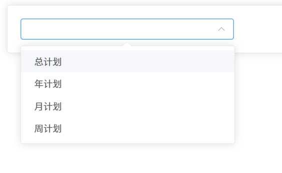
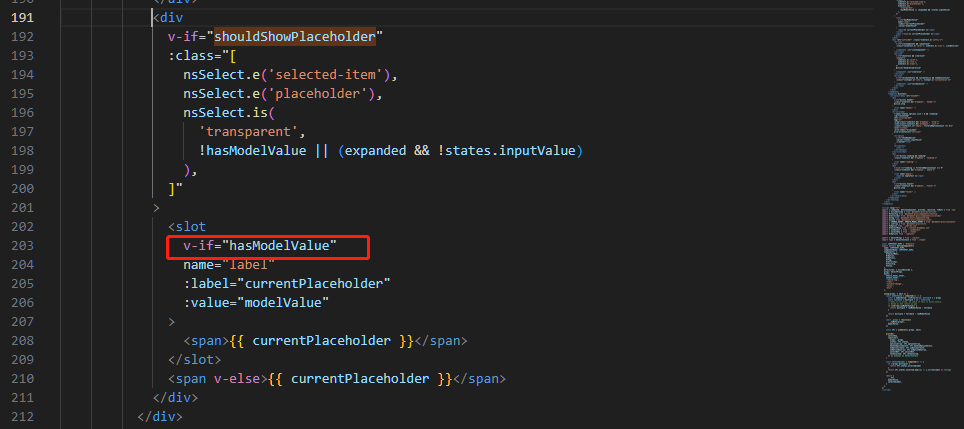
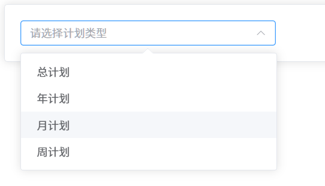

# element-plus 问题记录

## el-select 选择器 placeholder 不显示问题

**问题描述**：在使用 element-plus 的 选择器组件 (`el-select`)  组件时，当绑定的值是空字符串时，发现 placeholder 不显示，为
`null` 会正常显示。



```vue

<script lang="ts" setup>
	import { ref } from 'vue'
	import { ElSelect, ElCard, ElOption } from "element-plus";

	const planTypeOptions = [
		{label: '总计划', value: 1},
		{label: '年计划', value: 2},
		{label: '月计划', value: 3},
		{label: '周计划', value: 4}
	]

	const planType = ref('')
</script>

<template>
	<el-card>
		<el-select v-model="planType" clearable placeholder="请选择计划类型">
			<el-option
				v-for="item in planTypeOptions"
				:key="item.value" :label="item.label"
				:value="item.value"
			/>
		</el-select>
	</el-card>
</template>

```

查阅源代码，关键代码如下
查看源码：[el-select 组件源码](https://github.com/element-plus/element-plus/tree/dev/packages/components/select)



```ts
const hasModelValue = computed(() => {
	return isArray(props.modelValue)
		? props.modelValue.length > 0
		: !isEmptyValue(props.modelValue)
})
```

```ts
const DEFAULT_EMPTY_VALUES = ['', undefined, null]

const config = getCurrentInstance()
	? inject(emptyValuesContextKey, ref<EmptyValuesContext>({}))
	: ref<EmptyValuesContext>({})

const emptyValues = computed(
	() => props.emptyValues || config.value.emptyValues || DEFAULT_EMPTY_VALUES
)

const isEmptyValue = (value: any) => {
	return emptyValues.value.includes(value)
}

```

通过这些代码可以大致分析出：
1. `hasModelValue` 是一个计算属性，会影响 `placeholder` 的显示;
2. 在单选模式下，`hasModelValue` 由`isEmptyValue`计算得来;
3. `isEmptyValue`的值为`props.emptyValues || config.value.emptyValues || DEFAULT_EMPTY_VALUES`

[查阅Api文档](https://element-plus.org/zh-CN/component/select.html#select-api)

尝试组件传递`:empyty-values="['', null, undefined]`可以正常显示`placeholder`

结合文档提到的[config-provider](https://element-plus.org/en-US/component/config-provider.html#empty-values-configurations)配置
查看自己的代码，在`app.vue`发现如下配置
```vue
<template>
	<el-config-provider  :empty-values="[undefined, null]" :locale="zhCn">
		<RouterView />
	</el-config-provider>
</template>
```
修改为`:empyty-values="['', null, undefined]` 可以正常显示



**结论**：因为全局配置了`:empty-values="[undefined, null]"`，`Select`当绑定的值是空字符串时，判断绑定的值不为空，所以`placeholder`不显示。
