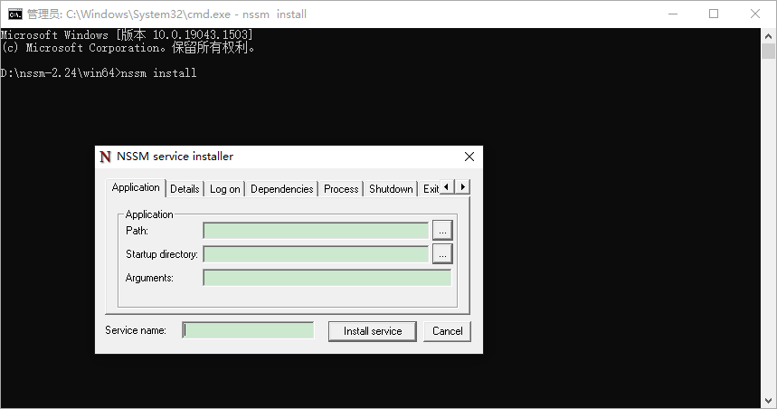

# windows守护进程工具--nssm详解
NSSM(the Non-Sucking Service Manager)是Windows环境下一款免安装的服务管理软件，它可以将应用封装成服务，即将普通exe程序或者jar包应用,封装成服务使之像windows服务可以设置自动启动等。并且可以监控程序运行状态，程序异常中断后自动启动，实现守护进程的功能。


[官网地址](https://nssm.cc/)


它的特点如下：

- 支持普通exe程序（控制台程序或者带界面的Windows程序都可以）
- 安装简单，修改方便
- 可以自动守护封装了的服务，程序挂掉了后可以自动重启

## 常用命令
```bash
nssm install servername # 创建servername服务,弹出配置界面
nssm start servername # 启动服务
nssm stop servername # 暂停服务
nssm restart servername #重新启动服务
nssm remove servername #删除创建的servername服务
nssm edit servername # 更改servername服务，弹出修改界面
nssm set servername #  参数名 参数值 //设置服务参数值
sc delete servername # windows删除服务命令
# 直接使用windows的服务管理也可以实现服务的操作，服务右键属性 - 恢复即可设置服务挂掉重启等内容。
```


## 添加服务

配置项说明：
- Path：运行应用程序的程序

- Startup directory：应用程序所在的目录

- Arguments：应用运行的参数

- Service name：生成服务的名称

最后点击install service 完成windows服务安装，在windows服务列表就能看到创建的服务了。



:::details 参考链接

[NSSM通俗易懂介绍,安装与使用](https://blog.csdn.net/raojiaxing_/article/details/125291372)

[windows守护进程工具--nssm详解](https://www.cnblogs.com/fps2tao/p/16433588.html)

[NSSM 使用教程 - Windows 下强大、简单的服务管理工具附下载链接](https://www.mumudroid.com/topic_detail/0162.html)

:::