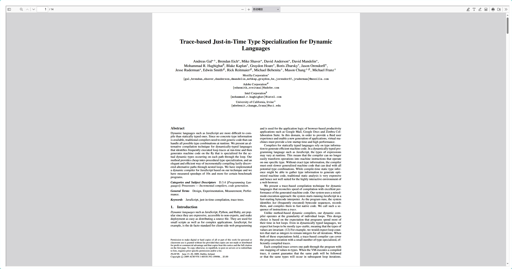
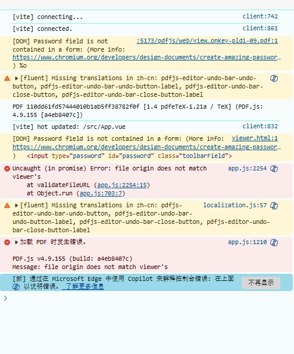
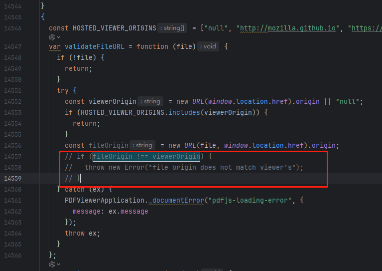

# 使用 pdf.js 预览 pdf 文件

在进行 PDF 文件 预览时，原本打算使用浏览器内置的 pdf 预览，即使用 `iframe` 标签 加载，但是发现在浏览器中会报错：
`Refused to display 'http://localhost:8080/' in a frame because it set 'X-Frame-Options'。`

测试了几个 pdf 预览库，最终选择了 pdf.js

## PDF.js 库简介和功能概述
PDF.js 是一个由 Mozilla 开发的 JavaScript 库，用于在 Web 上显示 PDF 文件。它具有以下功能：

- 在浏览器中原生渲染 PDF：PDF.js 可以直接在浏览器中渲染 PDF 文件，无需依赖外部插件或软件。
- 支持基本的查看和导航功能：PDF.js 提供了一些基本的查看和导航功能，如缩放、翻页、搜索等。
- 自定义样式和交互：PDF.js 允许开发者通过 API 自定义 PDF 文件的显示样式和交互行为。
- 跨平台支持：PDF.js 可以在各种现代浏览器和操作系统上运行，包括桌面和移动设备。

## 下载

[官方下载地址](https://mozilla.github.io/pdf.js/getting_started/#download)


```
├── build/
│   ├── pdf.js                             - display layer
│   ├── pdf.js.map                         - display layer's source map
│   ├── pdf.worker.js                      - core layer
│   └── pdf.worker.js.map                  - core layer's source map
├── web/
│   ├── cmaps/                             - character maps (required by core)
│   ├── compressed.tracemonkey-pldi-09.pdf - PDF file for testing purposes
│   ├── debugger.js                        - helpful debugging features
│   ├── images/                            - images for the viewer and annotation icons
│   ├── locale/                            - translation files
│   ├── viewer.css                         - viewer style sheet
│   ├── viewer.html                        - viewer layout
│   ├── viewer.js                          - viewer layer
│   └── viewer.js.map                      - viewer layer's source map
└── LICENSE
```


## 使用


将下载的文件解压放到 public 文件夹下,为了区分，我单独建立了一个文件夹

本文使用 `iframe` 的方式来显示 pdf 文件 参数：`file` 是 pdf 文件路径

```vue
<script setup lang="ts">
</script>

<template>
	<iframe src="/pdfjs/web/compressed.tracemonkey-pldi-09.pdf" style="width: 100%;height: 100%;"/>
</template>

<style scoped>

</style>

```




## 跨域问题
将测试的 pdf 文件放在服务器上，通过浏览器可以访问到，在 iframe 中加载 pdf 文件，会报错：



会有跨域的问题，需要对源码进行修改, 将web/viewer.js中第 如下代码注释掉

```js
if (fileOrigin !== viewerOrigin) {
	throw new Error("file origin does not match viewer's");
}
```
如下图所示：




## mjs mime type 问题

项目打包部署后，在浏览器控制台报如下错误

```
Failed to load module script: The server responded with a non-JavaScript MIME type of "application/octet-stream".
Strict MIME type checking is enforced for module scripts per HTML spec.
```

**原因是** nginx无法识别 mjs 文件，设置的响应类型为 `Content-Type:application/octet-stream` ，
导致浏览器直接下载文件，而不是当作js脚本执行。

**解决方法**修改 nginx 配置文件下的 `mime.types` 文件，在 application/javascript 后面添加 mjs ，将 mjs 文件的响应类型修改为 `application/javascript`。

```
types {
    // ...
    application/javascript                           js;
    // ...
}
```

```
types {
    // ...
    application/javascript                           js mjs;
    // ...
}
```