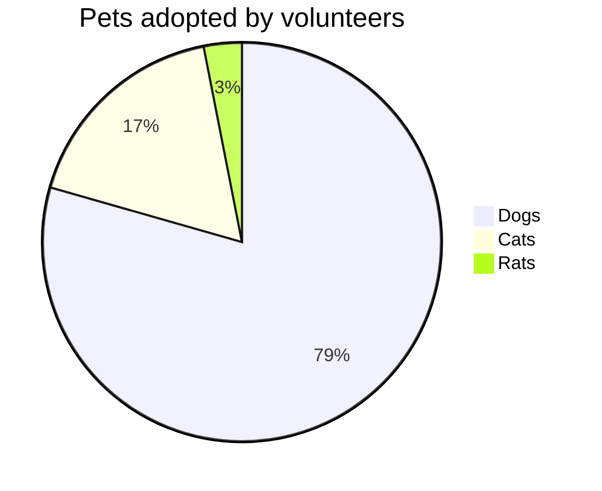
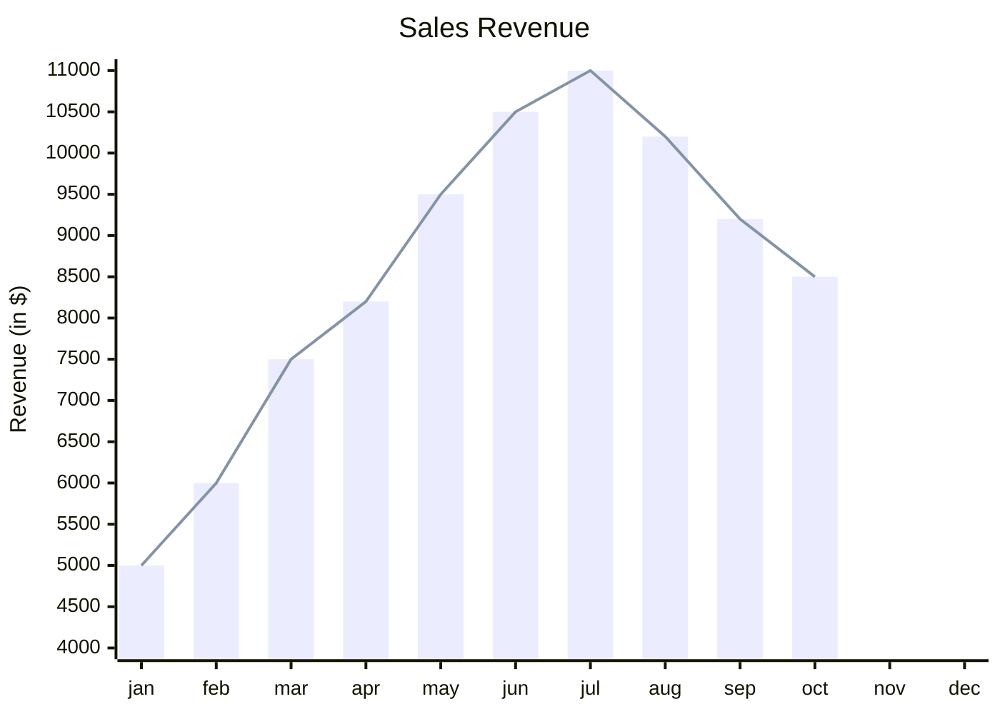
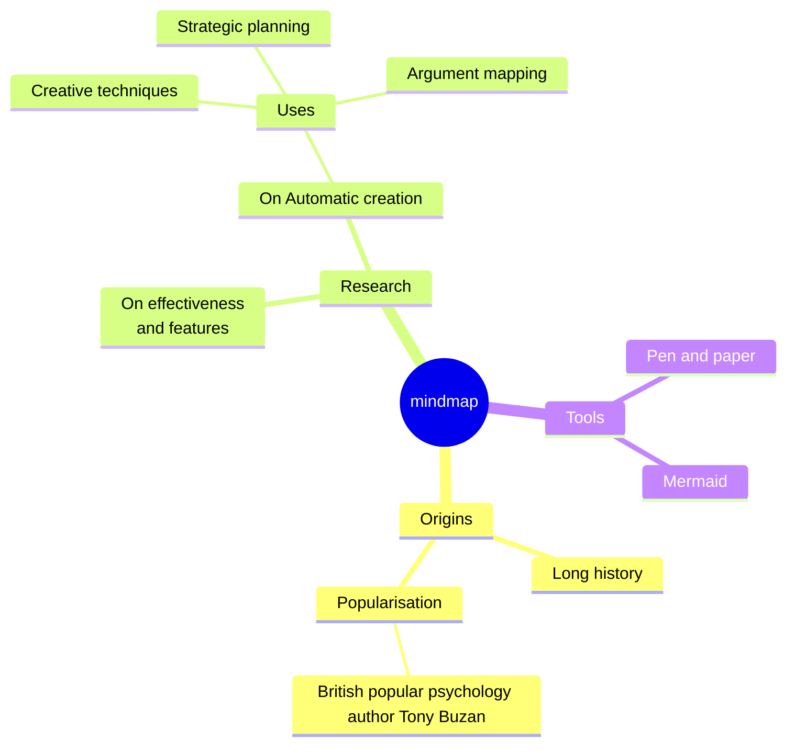

# 在 vitepress 使用 mermaid 绘制图表

## 安装 插件

::: code-group

```shell [pnpm]
pnpm add mermaid

pnpm add vitepress-plugin-mermaid -d
```

:::

## 修改配置 config.mts 

::: code-group

```ts
import { MermaidMarkdown, MermaidPlugin } from 'vitepress-plugin-mermaid'; // [!code ++]

export default defineConfig({
	// ... 其他配置
	markdown: {
		config(md) {
			md.use(groupIconMdPlugin) //代码组图标
			md.use(MermaidMarkdown); // [!code ++]
		},
	},
    
	vite: {
		ssr: {
			noExternal: ['naive-ui', 'date-fns', 'vueuc', 'mermaid'],
		},
        
		optimizeDeps: {
			include: ['mermaid'],
		},
        
		plugins: [
			// ...
			MermaidPlugin(),	// [!code ++]
		],
	},
})

```

:::

## 使用示例

### 流程图

**输入**

```` markdown

````

**输出**


### 饼图

````markdown

**输入**


````

## XY 图

**输入**
````

````
**输出**

**输出**


### 思维导图

````markdown

**输入**


````

**输出**


## 更多 图表类型 参考
> [mermaid 中文文档](https://mermaid.nodejs.cn/)


> https://emersonbottero.github.io/vitepress-plugin-mermaid/
